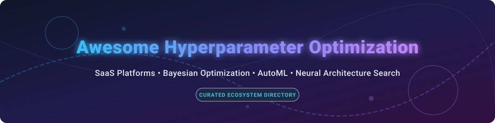
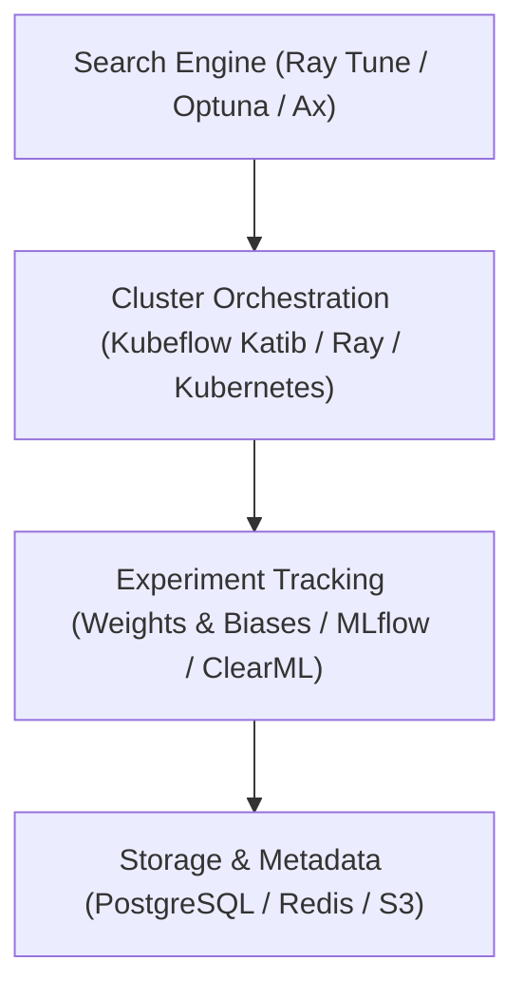

  

# 🚀 Awesome Hyperparameter Optimization Platform & Tools Ecosystem

  
  
  
  

> **The definitive curated directory of Hyperparameter Optimization (HPO) 🎛️, AutoML 🤖, Bayesian Optimization 🎯, and Neural Architecture Search (NAS) 🧠 SaaS platforms & open-source frameworks.**

---

## 📌 Table of Contents
- [📊 Market Landscape & Overview](#-market-landscape--overview)
- [☁️ SaaS & Managed HPO Platforms](#️-saas--managed-hpo-platforms)
- [🔓 Open-Source HPO & AutoML Libraries](#-open-source-hpo--automl-libraries)
- [🛠️ Architecture & Building Blocks](#️-architecture--building-blocks)
- [🤝 Contributing](#-contributing)
- [❤️ Support & Sponsorship](#️-support--sponsorship)
- [📈 Star History](#-star-history)
- [📜 Disclaimer](#-disclaimer)

---

## 📊 Market Landscape & Overview 📈

The global **Hyperparameter Optimization (HPO) and AutoML market** is estimated at **$1.2 Billion to $1.5 Billion (2026)** and is projected to expand rapidly alongside enterprise adoption of generative AI, deep learning, and custom model fine-tuning. 🚀

### 🔍 Market Fragmentation Analysis
The HPO sector exhibits **moderate fragmentation with multi-cloud and MLOps consolidation**:
- ☁️ **Public Cloud Leaders (AWS, Google Cloud):** Offer managed HPO services bundled directly into broader ML suites (SageMaker, Vertex AI).
- 🛠️ **MLOps & Experiment Tracking Platforms (Weights & Biases, Comet, ClearML):** Provide integrated HPO suites to streamline trial tracking, visualization, and hyperparameter tuning in one ecosystem.
- 🔓 **Open-Source Dominance:** Core algorithm development is dominated by community-driven frameworks (Ray Tune, Optuna, Ax/BoTorch, NNI), while specialized enterprise solutions (SigOpt/Intel, Determined AI/HPE) have been acquired to power hardware-accelerated deep learning stacks.

---

## ☁️ SaaS & Managed HPO Platforms 🌐

Below is a comparison of leading SaaS and enterprise-managed hyperparameter optimization platforms, ordered by company size (valuation / revenue / parent enterprise size, descending). 🏢

| Platform 🏷️ | Starting Tier Price 💰 | Free Tier / Trial Limits 🎁 | Parent / Company Size 📊 | Description & Key Features 📝 |
| :--- | :--- | :--- | :--- | :--- |
| **[Amazon SageMaker HPO](https://aws.amazon.com/sagemaker/)** | \$0.05 per vCPU-hour / \$0.26 per GPU-hour (pay-as-you-go compute) | **2 months free trial** via AWS Free Tier (250 hours/month ml.m5.xlarge or ml.t3.medium) | **\$2.4 Trillion** market cap (Amazon) | Enterprise cloud-native tuning supporting Bayesian, Hyperband, and random search with automated early stopping. |
| **[Google Cloud Vertex Vizier](https://cloud.google.com/vertex-ai)** | \$0.045 per vCPU-hour / \$0.35 per GPU-hour + Vizier service fee | **\$300 free credits** for new Google Cloud users (valid for 90 days across Vertex AI services) | **\$2.1 Trillion** market cap (Alphabet) | Black-box Bayesian optimization service based on Google Vizier, supporting multi-objective tuning and transfer learning. |
| **[Determined AI](https://www.determined.ai/)** (HPE) | \$1.20 per node-hour (HPE Machine Learning Development Environment) | **30-day free trial** or self-hosted open-source core with unlimited local compute | **\$25 Billion** market cap (Hewlett Packard Enterprise) | Deep learning platform featuring built-in distributed HPO using Adaptive Hyperband (ASHA) and resource management. |
| **[SigOpt](https://sigopt.com/)** (Intel) | \$15,000 / year (Enterprise Tier) | **30-day enterprise trial** available upon sales request; open-source SigOpt API client | **\$90 Billion** market cap (Intel Corporation) | Enterprise Bayesian optimization platform for complex simulation, deep learning, and multi-objective experiment design. |
| **[Weights & Biases Sweeps](https://wandb.ai/site/sweeps)** | \$50 per user/month (Team Tier) | **Free Forever Personal Tier** (1 user, 100 GB storage, unlimited Sweeps & HPO runs) | **\$1.2 Billion** valuation (Series C funding) | Developer-favorite experiment tracking platform with built-in Hyperparameter Sweeps (Bayesian, Grid, Random) and dynamic visualization. |
| **[ClearML HPO](https://clear.ml/)** | \$15 per user/month (Pro Tier) | **Free Forever Community Tier** (Up to 3 users, 100 GB storage, full HPO pipeline access) | **\$150 Million** estimated valuation | Open-source & cloud MLOps platform supporting Optuna, BOHB, and RandomSearch with automated execution orchestration. |
| **[Comet Optimizer](https://www.comet.com/)** | \$179 per month (Team Tier) | **Free Forever Individual Tier** (1 user, 1 concurrent job, 500 hours tracking/year) | **\$100 Million** estimated valuation | Full MLOps & experiment management system with Comet Optimizer for multi-parameter grid/random/Bayesian optimization. |
| **[Optuna Hub](https://hub.optuna.org/)** | \$0 / month (Community Hosted Hub) | **100% Free & Open Community Service** (Unlimited module discovery & sharing) | **Community / Preferred Networks** (~ \$2 Billion valuation) | Central registry for discovering, sharing, and evaluating custom Optuna algorithms, samplers, and visualization tools. |

---

## 🔓 Open-Source HPO & AutoML Libraries ⚡

The table below lists top open-source repositories for hyperparameter tuning, neural architecture search, and Bayesian optimization, sorted by **GitHub Star Count** (descending). ⭐

| Repository 📦 | GitHub Stars 🌟 | License 📄 | Primary Search Algorithms & Features 💡 |
| :--- | :---: | :---: | :--- |
| **[Ray Tune](https://github.com/ray-project/ray)** |  | Apache 2.0 | Scalable distributed hyperparameter tuning engine. Supports ASHA, Hyperband, BOHB, PBT, and Bayesian search across PyTorch, TensorFlow, and XGBoost. |
| **[Optuna](https://github.com/optuna/optuna)** |  | MIT | Imperative define-by-run HPO framework featuring TPE, CMA-ES, hyperband pruning, multi-objective optimization, and distributed worker execution. |
| **[NNI (Neural Network Intelligence)](https://github.com/microsoft/nni)** |  | MIT | Microsoft's AutoML toolkit for hyperparameter tuning, Neural Architecture Search (NAS), and model compression across local, Kubernetes, and cloud environments. |
| **[AutoGluon](https://github.com/autogluon/autogluon)** |  | Apache 2.0 | AWS AutoML toolkit automating HPO, ensembling, and deep learning model architecture search for tabular, text, image, and time-series data. |
| **[Hyperopt](https://github.com/hyperopt/hyperopt)** |  | BSD-3-Clause | Asynchronous distributed hyperparameter optimization library implementing Tree-structured Parzen Estimator (TPE) and Random Search over complex search spaces. |
| **[ClearML](https://github.com/allegroai/clearml)** |  | Apache 2.0 | Open-source MLOps suite with built-in HPO engine, experiment tracking, and agent orchestration for distributed search task execution. |
| **[Ludwig](https://github.com/uber/ludwig)** |  | Apache 2.0 | Declarative deep learning framework by Uber/Predibase with native hyperparameter tuning integrated via Ray Tune. |
| **[BayesianOptimization](https://github.com/bayesian-optimization/BayesianOptimization)** |  | MIT | Lightweight, pure Python implementation of global optimization with Gaussian processes and acquisition function maximization. |
| **[BoTorch](https://github.com/pytorch/botorch)** |  | MIT | PyTorch-based modular Bayesian optimization framework using Monte Carlo acquisition functions and Gaussian Process regression. |
| **[Determined](https://github.com/determined-ai/determined)** |  | Apache 2.0 | Open-source deep learning platform with native state-of-the-art hyperparameter tuning (Adaptive ASHA), GPU scheduling, and smart checkpointing. |
| **[Ax (Adaptive Experimentation)](https://github.com/facebook/Ax)** |  | MIT | Meta's adaptive experimentation platform built on BoTorch for multi-objective optimization, sequential A/B testing, and HPO. |
| **[Katib](https://github.com/kubeflow/katib)** |  | Apache 2.0 | Kubernetes-native HPO and Neural Architecture Search (NAS) controller for Kubeflow supporting Random, Grid, Bayesian, CMA-ES, and ENAS. |
| **[SMAC3](https://github.com/automl/SMAC3)** |  | BSD-3-Clause | Sequential Model-based Algorithm Configuration in Python for evaluating continuous, categorical, and conditional hyperparameter spaces. |
| **[Dragonfly](https://github.com/dragonfly/dragonfly)** |  | MIT | Scalable Bayesian optimization library supporting multi-fidelity, multi-objective, and high-dimensional parameter spaces. |
| **[GPyOpt](https://github.com/SheffieldML/GPyOpt)** |  | BSD-3-Clause | Python framework for domain-agnostic Bayesian optimization based on Gaussian processes from the Sheffield Machine Learning group. |
| **[HEBO](https://github.com/huawei-noah/HEBO)** |  | MIT | Heteroscedastic Evolutionary Bayesian Optimization from Huawei Noah's Ark Lab, winner of the NeurIPS 2020 Black-Box Optimization Challenge. |
| **[OptunaHub](https://github.com/optuna/optunahub)** |  | MIT | Official registry of packages and extensions for Optuna, enabling community algorithm sharing and modular HPO pipelines. |
| **[mlr3mbo](https://github.com/mlr-org/mlr3mbo)** |  | LGPL-3.0 | R ecosystem package for flexible model-based optimization, Bayesian tuning, and multi-objective algorithm configuration. |

---

## 🛠️ Architecture & Building Blocks 🏗️

When constructing custom enterprise HPO and AutoML pipelines, engineers often combine tools across layers:

- ⚙️ **Tuning Engines:** Optuna, Ray Tune, BoTorch, SMAC3.
- ☸️ **Orchestration Controllers:** Katib (Kubernetes CRDs), Determined AI, Ray Cluster Manager.
- 📊 **Experiment Tracking:** Weights & Biases, MLflow, Comet, ClearML.
- 🔌 **Integrations:** PyTorch Lightning, XGBoost, LightGBM, scikit-learn.

---

## 🤝 Contributing 📝

Contributions are welcome! Please follow these steps to add or update entry data:

1. 🍴 Fork the repository.
2. ✏️ Edit `README.md` keeping the Markdown tabular formatting consistent.
3. 🔍 Ensure links, licensing, star badge syntax, and pricing details are verified.
4. 🚀 Submit a Pull Request with a short summary of changes.

---

## ❤️ Support & Sponsorship ☕

Thank you for exploring and utilizing the **Awesome Hyperparameter Optimization Platform** ecosystem guide! 🌟

If you find this resource helpful for your machine learning engineering workflows, research, or enterprise infrastructure design, please consider supporting the project:

- ⭐ **Star this repository** to help others discover it on GitHub.
- 🔀 **Fork and share** it with your fellow ML engineers, data scientists, and MLOps teams.
- ☕ **Buy me a coffee / Sponsor the project:** Your contributions directly fund continuous updates and open-source tooling maintenance. Visit the [GitHub Sponsor Dashboard](https://github.com/sponsors/ishandutta2007) to become a sponsor!

---

## 📈 Star History

---

## 📜 Disclaimer ⚠️

This directory is community-curated for informational purposes. Hyperparameter optimization jobs consume substantial compute; monitor GPU/CPU cloud costs closely.

---

*Maintained with ❤️ by the Open AutoML & MLOps Community.*
